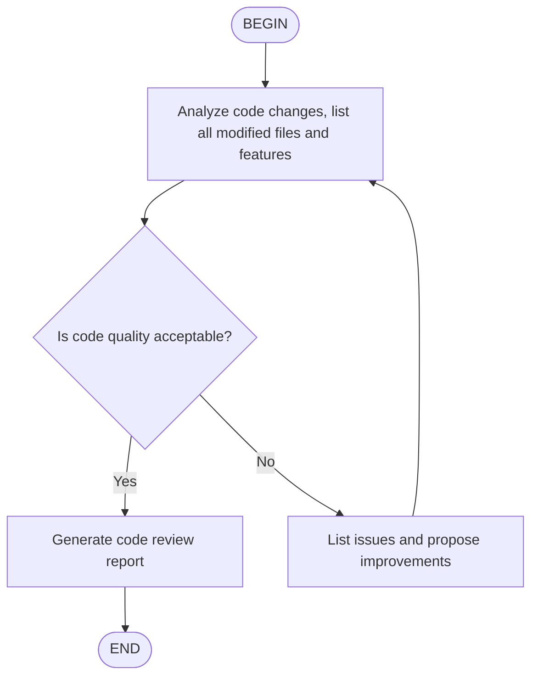

# Agent Skills

[Agent Skills](https://agentskills.io/) is an open format for adding specialized knowledge and workflows to AI agents. Kimi Code CLI supports loading Agent Skills to extend AI capabilities.

## What are Agent Skills

A skill is a directory containing a `SKILL.md` file. When Kimi Code CLI starts, it discovers all skills and injects their names, paths, and descriptions into the system prompt. The AI will decide on its own whether to read the specific `SKILL.md` file to get detailed guidance based on the current task's needs.

For example, you can create a "code style" skill to tell the AI your project's naming conventions, comment styles, etc.; or create a "security audit" skill to have the AI focus on specific security issues when reviewing code.

**Skills vs plugins**

Kimi Code CLI supports two extension mechanisms:

- **Skills**: Provide knowledge-based guidance through `SKILL.md`; the AI reads and follows the specifications. Suitable for defining code styles, workflows, and best practices.
- **Plugins**: Declare executable tools through `plugin.json`; the AI can directly invoke tools to get results. Suitable for wrapping scripts, API calls, and database queries.

For details about plugins, see the [Plugins](./plugins.md) documentation.

## Skill discovery

Kimi Code CLI uses a layered loading mechanism to discover skills. Roots are scanned in priority order — when a skill name is defined in more than one scope, the more specific scope wins:

**Project > User > Extra > Built-in**

**Built-in skills**

Skills shipped with the package, providing basic capabilities. Lowest priority.

**User-level skills**

Stored in the user's home directory, effective across all projects. Candidate directories are split into two groups; within each group, the first existing directory is selected, and results from both groups are merged independently (brand group has higher specificity and priority):

- **Brand group** (mutually exclusive):
  1. `~/.kimi/skills/`
  2. `~/.claude/skills/`
  3. `~/.codex/skills/`
- **Generic group** (mutually exclusive):
  1. `~/.config/agents/skills/` (recommended)
  2. `~/.agents/skills/`

Both groups are searched independently and results are merged. When a skill with the same name exists in both groups, the brand group version takes priority.

By default, **all existing brand directories are loaded and merged**, with same-name skills resolved by priority: kimi > claude > codex. The generic group is not affected. This "merge everything" behaviour is controlled by `merge_all_available_skills`, which defaults to `true`:

```toml
# Default; merges every brand directory that exists.
merge_all_available_skills = true
```

Set it to `false` to restore the older first-match-only behaviour, where only the highest-priority existing brand directory is used (kimi, or claude if kimi is absent, and so on):

```toml
merge_all_available_skills = false
```

**Project-level skills**

Stored in the project directory, effective within that project. Candidate paths are resolved relative to the **project root** (the nearest `.git` ancestor of the work directory, falling back to the work directory itself when there is no `.git` marker), so launching kimi-cli from a subdirectory of a monorepo still surfaces skills defined at the repository root. The same two-group split as user-level skills applies:

- **Brand group** (mutually exclusive):
  1. `.kimi/skills/`
  2. `.claude/skills/`
  3. `.codex/skills/`
- **Generic group**: `.agents/skills/`

The `merge_all_available_skills` config applies to project-level skills as well.

You can also specify additional skills directories with the `--skills-dir` flag. This flag can be specified multiple times, and the directories override the auto-discovered user/project directories:

```sh
kimi --skills-dir /path/to/my-skills --skills-dir /path/to/more-skills
```

**Extra skills directories (additive)**

To add custom skills directories **on top of** the built-in / user / project discovery (not instead of them), set `extra_skill_dirs` in your config:

```toml
extra_skill_dirs = [
    "~/my-skills-collection",   # `~` is expanded to $HOME
    ".claude/plugins/my-skills", # relative entries resolve against the project root
    "/opt/team-shared/skills",  # absolute paths are used as-is
]
```

Each entry can be an absolute path, a `~`-prefixed path, or a path relative to the project root (the nearest `.git` directory above the work directory). Non-existent entries are silently skipped. Skills discovered from these directories are grouped under the `Extra` scope in the system prompt.

**How skills are presented to the AI**

Discovered skills are injected into the system prompt grouped by origin scope (`Project` / `User` / `Extra` / `Built-in`). Empty groups are omitted. This lets the AI distinguish project-specific skills from user-level ones when you refer to "the skill in this project" vs. "the user-scope skill".

**Flat `.md` skills**

In addition to the canonical `<name>/SKILL.md` subdirectory layout, a single `.md` file placed directly in a skills directory is also recognised as a skill. Its `name` defaults to the filename without the `.md` extension.

```
~/my-skills-collection/
├── demo-ui-components.md    # flat: name = "demo-ui-components"
└── deploy/                   # subdirectory: name = "deploy"
    └── SKILL.md
```

If a flat `.md` and a subdirectory share the same name in the same directory, the subdirectory wins and a warning is logged.

**Description resolution**

Regardless of form (subdirectory or flat), each skill's `description` is resolved by the same chain:

1. Frontmatter `description:` field (preferred — follow the [SKILL.md spec](https://agentskills.io/specification))
2. First non-empty line of the body (fallback; truncated at 240 characters)
3. `"No description provided."` (last resort)

::: tip
Skills paths are independent of [`KIMI_SHARE_DIR`](../configuration/env-vars.md#kimi-share-dir). `KIMI_SHARE_DIR` customizes the storage location for configuration, sessions, logs, and other runtime data, but does not affect Skills search paths. Skills are cross-tool shared capability extensions (compatible with Kimi CLI, Claude, Codex, and others), which is a different type of data from application runtime data. To specify custom skills paths, use the `--skills-dir` flag or `extra_skill_dirs` config.
:::

## Built-in skills

Kimi Code CLI includes the following built-in skills:

- **kimi-cli-help**: Kimi Code CLI help. Answers questions about Kimi Code CLI installation, configuration, slash commands, keyboard shortcuts, MCP integration, providers, environment variables, and more.
- **skill-creator**: Guide for creating skills. When you need to create a new skill (or update an existing skill) to extend Kimi's capabilities, you can use this skill to get detailed creation guidance and best practices.

## Creating a skill

Creating a skill only requires two steps:

1. Create a subdirectory in the skills directory
2. Create a `SKILL.md` file in the subdirectory

**Directory structure**

A skill directory needs at least a `SKILL.md` file, and can also include auxiliary directories to organize more complex content:

```
~/.config/agents/skills/
└── my-skill/
    ├── SKILL.md          # Required: main file
    ├── scripts/          # Optional: script files
    ├── references/       # Optional: reference documents
    └── assets/           # Optional: other resources
```

**`SKILL.md` format**

`SKILL.md` uses YAML frontmatter to define metadata, followed by prompt content in Markdown format:

```markdown
---
name: code-style
description: My project's code style guidelines
---

## Code Style

In this project, please follow these conventions:

- Use 4-space indentation
- Variable names use camelCase
- Function names use snake_case
- Every function needs a docstring
- Lines should not exceed 100 characters
```

**Frontmatter fields**

| Field | Description | Required |
|-------|-------------|----------|
| `name` | Skill name, 1-64 characters, only lowercase letters, numbers, and hyphens allowed; defaults to directory name if omitted | No |
| `description` | Skill description, 1-1024 characters, explaining the skill's purpose and use cases; shows "No description provided." if omitted | No |
| `license` | License name or file reference | No |
| `compatibility` | Environment requirements, up to 500 characters | No |
| `metadata` | Additional key-value attributes | No |

**Best practices**

- Keep `SKILL.md` under 500 lines, move detailed content to `scripts/`, `references/`, or `assets/` directories
- Use relative paths in `SKILL.md` to reference other files
- Provide clear step-by-step instructions, input/output examples, and edge case explanations

## Example skills

**PowerPoint creation**

```markdown
---
name: pptx
description: Create and edit PowerPoint presentations
---

## PPT Creation Workflow

When creating presentations, follow these steps:

1. Analyze content structure, plan slide outline
2. Choose appropriate color scheme and fonts
3. Use python-pptx library to generate .pptx files

## Design Principles

- Each slide focuses on one topic
- Keep text concise, use bullet points instead of long paragraphs
- Maintain clear visual hierarchy with distinct titles, body, and notes
- Use consistent colors, avoid more than 3 main colors
```

**Python project standards**

```markdown
---
name: python-project
description: Python project development standards, including code style, testing, and dependency management
---

## Python Development Standards

- Use Python 3.14+
- Use ruff for code formatting and linting
- Use pyright for type checking
- Use pytest for testing
- Use uv for dependency management

Code style:
- Line length limit 100 characters
- Use type annotations
- Public functions need docstrings
```

**Git commit conventions**

```markdown
---
name: git-commits
description: Git commit message conventions using Conventional Commits format
---

## Git Commit Conventions

Use Conventional Commits format:

type(scope): description

Allowed types: feat, fix, docs, style, refactor, test, chore

Examples:
- feat(auth): add OAuth login support
- fix(api): fix user query returning null
- docs(readme): update installation instructions
```

## Using slash commands to load a skill

The `/skill:<name>` slash command lets you save commonly used prompt templates as skills and quickly invoke them when needed. When you enter the command, Kimi Code CLI reads the corresponding `SKILL.md` file content and sends it to the Agent as a prompt.

For example:

- `/skill:code-style`: Load code style guidelines
- `/skill:pptx`: Load PPT creation workflow
- `/skill:git-commits fix user login issue`: Load Git commit conventions with an additional task description

You can append additional text after the slash command, which will be added to the skill prompt as the user's specific request.

::: tip
For regular conversations, the Agent will automatically decide whether to read skill content based on context, so you don't need to invoke it manually.
:::

Skills allow you to codify your team's best practices and project standards, ensuring the AI always follows consistent standards.

## Flow skills

Flow skills are a special skill type that embed an Agent Flow diagram in `SKILL.md`, used to define multi-step automated workflows. Unlike standard skills, flow skills are invoked via `/flow:<name>` commands and automatically execute multiple conversation turns following the flow diagram.

**Creating a flow skill**

To create a flow skill, set `type: flow` in the frontmatter and include a Mermaid or D2 code block in the content:

````markdown
---
name: code-review
description: Code review workflow
type: flow
---


````

**Flow diagram format**

Both Mermaid and D2 formats are supported:

- **Mermaid**: Use ` ```mermaid ` code block, [Mermaid Playground](https://www.mermaidchart.com/play) can be used for editing and preview
- **D2**: Use ` ```d2 ` code block, [D2 Playground](https://play.d2lang.com) can be used for editing and preview

Flow diagrams must contain one `BEGIN` node and one `END` node. Regular node text is sent to the Agent as a prompt; decision nodes require the Agent to output `<choice>branch name</choice>` in the output to select the next step.

**D2 format example**

```
BEGIN -> B -> C
B: Analyze existing code, write design doc for XXX feature
C: Review if design doc is detailed enough
C -> B: No
C -> D: Yes
D: Start implementation
D -> END
```

For multiline labels, you can use D2's block string syntax (`|md`):

```
BEGIN -> step -> END
step: |md
  # Detailed instructions

  1. Analyze code structure
  2. Check for potential issues
  3. Generate report
|
```

**Executing a flow skill**

Flow skills can be invoked in two ways:

- `/flow:<name>`: Execute the flow. The Agent will start from the `BEGIN` node and process each node according to the flow diagram definition until reaching the `END` node
- `/skill:<name>`: Like a standard skill, sends the `SKILL.md` content to the Agent as a prompt (does not automatically execute the flow)

```sh
# Execute the flow
/flow:code-review

# Load as a standard skill
/skill:code-review
```
